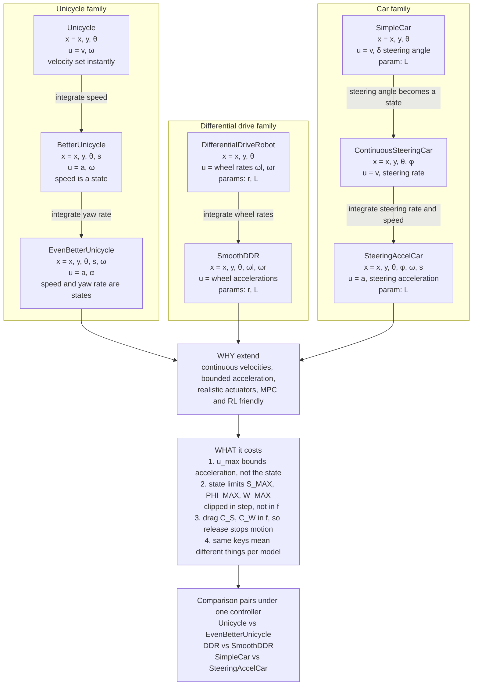

# Notes

Kinematics models don't take into account friction, so if the input is not a velocity, the model will keep running even if no key is being pressed.

```mermaid
flowchart TB
    subgraph U["Unicycle family"]
        U1["Unicycle<br/>x = x, y, θ<br/>u = v, ω<br/>velocity set instantly"]
        U2["BetterUnicycle<br/>x = x, y, θ, s<br/>u = a, ω<br/>speed is a state"]
        U3["EvenBetterUnicycle<br/>x = x, y, θ, s, ω<br/>u = a, α<br/>speed and yaw rate are states"]
        U1 -->|"integrate speed"| U2 -->|"integrate yaw rate"| U3
    end

    subgraph D["Differential drive family"]
        D1["DifferentialDriveRobot<br/>x = x, y, θ<br/>u = wheel rates ωl, ωr<br/>params: r, L"]
        D2["SmoothDDR<br/>x = x, y, θ, ωl, ωr<br/>u = wheel accelerations<br/>params: r, L"]
        D1 -->|"integrate wheel rates"| D2
    end

    subgraph C["Car family"]
        C1["SimpleCar<br/>x = x, y, θ<br/>u = v, δ steering angle<br/>param: L"]
        C2["ContinuousSteeringCar<br/>x = x, y, θ, φ<br/>u = v, steering rate"]
        C3["SteeringAccelCar<br/>x = x, y, θ, φ, ω, s<br/>u = a, steering acceleration<br/>param: L"]
        C1 -->|"steering angle becomes a state"| C2 -->|"integrate steering rate and speed"| C3
    end

    WHY["WHY extend<br/>continuous velocities, bounded acceleration,<br/>realistic actuators, MPC and RL friendly"]
    COST["WHAT it costs<br/>1. u_max bounds acceleration, not the state<br/>2. state limits S_MAX, PHI_MAX, W_MAX<br/>   clipped in step, not in f<br/>3. drag C_S, C_W in f, so release stops motion<br/>4. same keys mean different things per model"]

    U3 --> WHY
    D2 --> WHY
    C3 --> WHY
    WHY --> COST

    CMP["Comparison pairs under one controller<br/>Unicycle vs EvenBetterUnicycle<br/>DDR vs SmoothDDR<br/>SimpleCar vs SteeringAccelCar"]
    COST --> CMP

```
